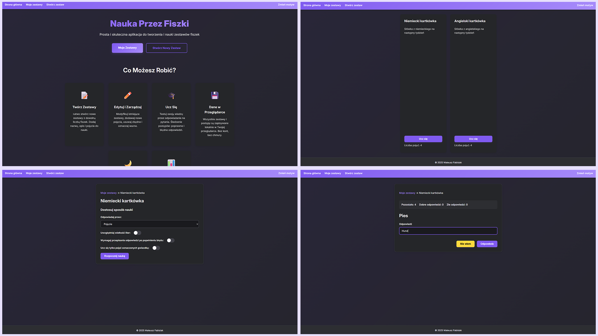

# 📚 Flashcards

This repository presents the **Flashcard Learning Application**, a robust and user-centric web application designed for
efficient knowledge acquisition and retention through interactive flashcards. Developed as a showcase of modern frontend
development principles, this project demonstrates a clean architecture, modular JavaScript, and a strong emphasis on
user experience.

The application operates entirely client-side, leveraging browser-side storage to provide a fast, private, and
offline-capable learning environment without requiring user accounts or server-side infrastructure.

🔗 **Live Demo:** [View Flashcards on GitHub Pages](https://mfabisiak.github.io/Flashcards/)



---

## 🚀 Key Features

The application is equipped with a comprehensive set of features designed to facilitate an engaging learning journey:

* **Dynamic Set Management:**
    * **Create & Organize:** Users can create an unlimited number of flashcard sets, each with a customizable name and
      description.
    * **CRUD Operations:** Full Create, Read, Update, and Delete (CRUD) functionality for both sets and individual
      flashcards.
    * **Starring System:** Mark important flashcards for focused review, allowing for targeted learning sessions.
* **Configurable Learning Sessions:**
    * **Directional Learning:** Choose to be prompted by the "term" and answer with the "definition," or vice versa.
    * **Case Sensitivity:** Toggle strict case matching for answers, catering to different learning requirements.
    * **Retyping for Reinforcement:** An optional feature that requires users to retype correct answers after a mistake,
      enhancing memory retention.
    * **Starred-Only Mode:** Concentrate learning efforts solely on previously starred flashcards.
* **Interactive Learning Interface:**
    * **Real-time Progress:** Live statistics display the number of remaining flashcards, correct answers, and incorrect
      answers during a session.
    * **Immediate Feedback:** Instant validation of answers with clear visual cues for correctness.
    * **Session Summary:** A detailed breakdown at the end of each session, including a list of all incorrect answers
      for review.
* **Persistent Local Storage:** All user-created data (sets and their content) is securely stored in the browser's
  `localStorage`, providing data persistence across sessions without server interaction.
* **Responsive Design & Theming:**
    * **Mobile-First Approach:** A fully responsive layout ensures optimal usability on desktops, tablets, and mobile
      phones.
    * **Dark/Light Mode Toggle:** User-selectable themes for personalized viewing comfort.
* **Modular & Maintainable Codebase:** Implemented with ES6 modules to promote separation of concerns, reusability, and
  easier debugging.

---

## 🛠️ Technical Stack

This project was crafted using fundamental web technologies, demonstrating a strong command over core frontend
development:

* **HTML5:** Utilized for semantic structuring of web pages, ensuring accessibility and search engine optimization.
* **CSS3:** Employed for a modern, responsive, and visually appealing user interface. This includes:
    * **CSS Variables:** For efficient theme management (dark/light mode).
    * **Flexbox & Grid:** For robust and adaptable layouts.
    * **Transitions & Animations:** For enhanced user feedback and dynamic interactions.
    * **Media Queries:** For comprehensive responsiveness across diverse devices.
* **JavaScript (ES6+):** The backbone of the application's logic, showcasing advanced features such as:
    * **ES6 Modules:** For a highly organized and maintainable codebase, promoting reusability and clear dependencies.
    * **Classes:** Object-Oriented Programming principles applied for `SetInstance` and `LearningSet` to encapsulate
      data and behavior.
    * **Asynchronous JavaScript (`async/await`, `Promise.any`):** Used for dynamic content loading (e.g., `header.html`,
      `footer.html`) and managing user input in learning mode, ensuring a non-blocking UI.
    * **DOM Manipulation:** Efficient and strategic manipulation of the Document Object Model for interactive elements.
    * **`localStorage` & `sessionStorage`:** For client-side data persistence and managing session-specific data.
    * **Iterators & Generators (`[Symbol.iterator]`):** Demonstrated for iterating over sets and their items, showcasing
      advanced JS features.

---

## 🏗️ Architecture & Design Patterns

The application follows a clean and modular architecture, emphasizing maintainability and separation of concerns.

* **Modular Design:** The project is structured using ES6 modules, with distinct files for different functionalities (
  e.g., `createSet.js`, `editSet.js`, `learn.js`). This approach improves readability, promotes reusability, and
  simplifies debugging.
* **Single Responsibility Principle:** Each JavaScript file and class is designed to handle a specific part of the
  application logic. For instance, `ClassSet.js` (containing `Sets`, `SetInstance`, and `LearningSet` classes) is solely
  responsible for data management and learning logic, while UI interactions are handled by page-specific scripts.
* **Data Encapsulation:** The `SetInstance` and `LearningSet` classes encapsulate the data and methods related to
  flashcard sets and learning sessions, respectively. This ensures data integrity and a clear API for interacting with
  set data.
* **Event-Driven Programming:** User interactions are handled through event listeners, allowing for a reactive and
  asynchronous user experience.
* **Client-Side Data Persistence:** Leveraging `localStorage` for permanent data storage and `sessionStorage` for
  temporary session-specific data (like the current learning set), optimizing performance and simplifying deployment.

---

## 💻 Installation & Local Setup

To get a local copy up and running, follow these simple steps.

1. **Clone the repository:**
   ```bash
   git clone https://github.com/mfabisiak/Flashcards.git
   ```
2. **Open the project folder.**
3. **Launch:** Open `index.html` in your browser (or use VS Code "Live Server" extension for the best experience).

---

## 📖 Usage Guide

Upon opening `index.html`, you will be greeted by the main landing page.

* **Navigation:** Use the header navigation to move between "Homepage," "My Sets," and "Create Set." There's also a "
  Change Theme" toggle.
* **Creating a New Set:**
    1. Go to the "Create Set" page.
    2. Enter a "Set Name" (required) and an optional "Set Description."
    3. Click "Dalej" (Continue) to create the set and be redirected to the "Edit Set" page.
* **Editing a Set:**
    1. On the "Edit Set" page, you can modify the set's name and description.
    2. Use the "Pojęcie" (Term) and "Definicja" (Definition) input fields to add new flashcards. Click "Dodaj pojęcie" (
       Add Term).
    3. Existing flashcards are displayed in a table. You can:
        * Click "Edytuj" (Edit) to modify a flashcard's term or definition.
        * Click "Usuń" (Delete) to remove a flashcard.
        * Use the "Gwiazdka" (Star) checkbox to mark/unmark a flashcard.
    4. Click "Zapisz" (Save) to finalize changes or "Usuń zestaw" (Delete Set) to remove the entire set.
* **Learning a Set:**
    1. Go to the "My Sets" page.
    2. Click the "Ucz się" (Learn) button on any set tile.
    3. This will take you to the "Konfiguruj naukę" (Learning Setup) page. Adjust the learning options (answer
       direction, case sensitivity, retyping, starred-only) as desired.
    4. Click "Rozpocznij naukę" (Start Learning) to begin the session.
    5. During the session, type your answer and click "Odpowiedz" (Answer) or "Nie wiem" (I don't know). Follow the
       prompts for correct or incorrect answers.
    6. After completing all flashcards, a summary of your performance will be displayed.

---

## 📂 Project Structure

The project is organized into logical directories and files to enhance clarity, maintainability, and scalability.

```text
FlashcardApp/
├── index.html                  # Main landing page for the application
├── create-set.html             # UI for creating new flashcard sets
├── edit-set.html               # UI for editing existing flashcard sets and their terms
├── my-sets.html                # UI displaying all available flashcard sets
├── learning-setup.html         # UI for configuring learning session preferences
├── learn.html                  # UI for the interactive flashcard learning session
├── header.html                 # Reusable HTML snippet for the common navigation header
├── footer.html                 # Reusable HTML snippet for the common footer
├── favicon.png                 # Application favicon
├── script/
│   ├── ClassSet.js             # Core JavaScript module: Defines `Sets` (static manager),
│   │                           # `SetInstance` (single set logic), and `LearningSet` (learning session logic) classes.
│   ├── createSet.js            # JavaScript logic for the `create-set.html` page, handles form submission.
│   ├── editSet.js              # JavaScript logic for the `edit-set.html` page, handles CRUD for terms, set details.
│   ├── mainScript.js           # Global JavaScript: Handles dynamic header/footer insertion, theme management, and mobile menu toggle.
│   ├── mySets.js               # JavaScript logic for the `my-sets.html` page, dynamically loads set tiles.
│   ├── learn.js                # JavaScript logic for the `learn.html` page, manages the learning flow, question display, and answer validation.
│   └── learningSetup.js        # JavaScript logic for the `learning-setup.html` page, saves learning preferences to `sessionStorage`.
└── style/
    └── style.css               # Comprehensive CSS stylesheet for the entire application, including responsive design and themes.
```

---

<div align="center">

  <br>

**© 2025 Mateusz Fabisiak**

</div>
